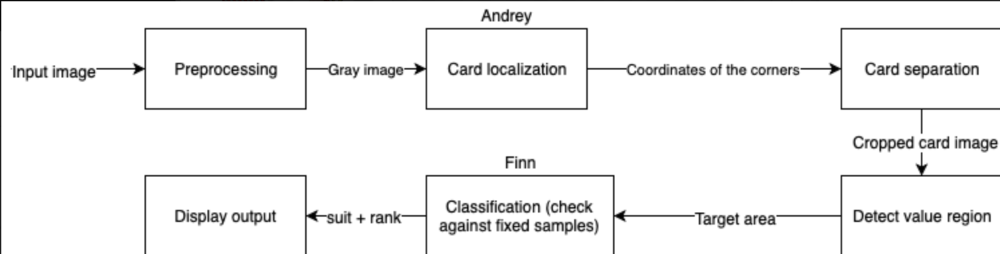

# Jack Bot
Classify all cards in an image by their rank and suit

---

In the [Athens](athensnetwork.eu) European Exchange programme at [Télécom ParisTech]([https://telecom-paristech.fr](https://telecom-paristech.fr/)) over the course of 4 days the [authors](#authors) have created a script to consecutively 

- Localize and single out the playing cards of an input image
- Detect the region containing the *rank* and *suit* in every card
- Classify both rank and suit by comparing against a reference dataset

## Running

Make sure you have `matplotlib`, `openCV`, `numpy` and `skimage`installed, then run 

```
python src/jackbot.py -p /path/to/input/image
```

## Architecture



More information about the internals of the project can be found in the [final presentation](https://drive.google.com/file/d/1qFl73Nb20_aACLSF3KZzjzMU6I5kwhEc/view?usp=sharing).

# Authors

- [Rounin](https://github.com/Claire1997)
- [Andrey Babushkin](https://github.com/mannannlegur)
- [Finn Gaida](https://github.com/finngaida)

